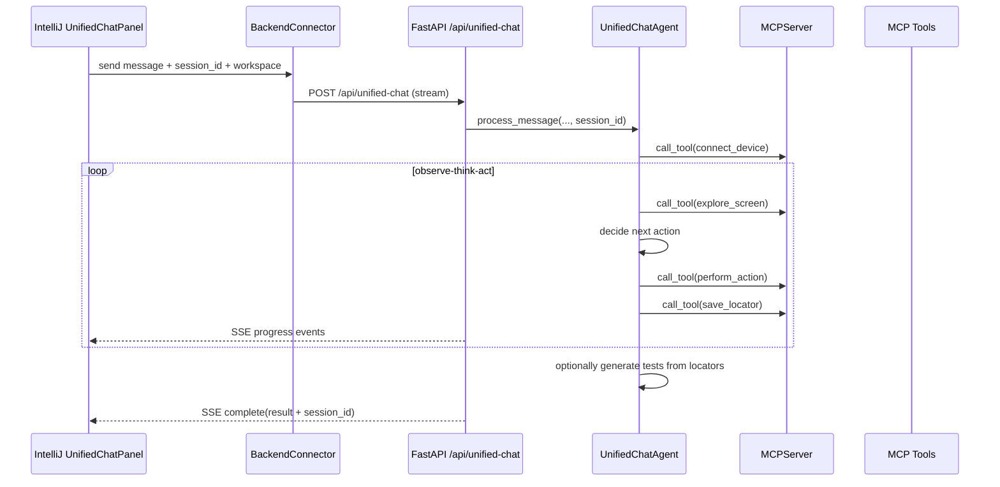

# ScriptSherpa Copilot Architecture

This document defines the target architecture for a real-time conversational app-automation copilot.

## Goals

- Multi-turn, session-based conversation (not one-shot bot replies)
- Observe-think-act execution loop over MCP tools
- Real-time streaming progress to IDE UI
- Seamless switch between exploration and test generation

## High-Level Components

1. IntelliJ Plugin UI
- File: intellij-plugin/src/main/java/com/bizom/scriptSherpa/ui/UnifiedChatPanel.java
- Responsibilities:
  - Collect user prompts
  - Persist and send session_id per chat thread
  - Expose runtime controls for agent_type, model, context_mode, and attached_files
  - Render streaming updates from server
  - Keep project workspace path as execution context
  - Persist and restore chat timeline + UI options in .scriptSherpa/unified_chat_state.json

2. Plugin Backend Connector
- File: intellij-plugin/src/main/java/com/bizom/scriptSherpa/backend/BackendConnector.java
- Responsibilities:
  - Send request to /api/unified-chat
  - Include session_id for continuity
  - Include option payload (agent_type, model, context_mode, attached_files)
  - Parse SSE events and push typed updates to UI

3. API Gateway
- File: api_server.py
- Responsibilities:
  - Accept chat requests on /api/unified-chat
  - Run agent in worker thread
  - Stream progress events over SSE
  - Return final result with session_id

4. Conversational Agent Core
- File: agents/unified_chat_agent.py
- Responsibilities:
  - Detect user intent and follow-up commands (continue, next, etc.)
  - Preserve per-session state and objective
  - Apply agent mode behavior (planner, balanced, executor)
  - Apply model preference and attachment context
  - Execute selected model provider for both response generation and next-action planning
  - Run MCP observe-think-act loop
  - Reuse locators across turns
  - Trigger code generation when requested

5. MCP Server + Tools
- Files: mcp/server.py, mcp/tools/*.py
- Responsibilities:
  - Dispatch MCP protocol methods (listTools, callTool, memory/session methods)
  - Execute atomic tools: connect_device, explore_screen, perform_action, save_locator

## Runtime Sequence

## Session Memory Model

- Plugin generates one UUID per chat panel instance.
- Same session_id is sent on every turn.
- Agent stores:
  - last_intent
  - last_objective
  - visited_xpaths
  - locators_file
  - short conversation history

## Event Contract (SSE)

Each event:

- type: understanding | intent | progress | step | success | warning | error | keepalive | complete
- message: user-readable update
- data: optional details

## Why this feels like a real copilot

- It keeps context instead of restarting each command.
- It autonomously explores with iterative execution.
- It streams intermediate reasoning/progress, not just final output.
- It can continue the same flow and then generate code in-place.
